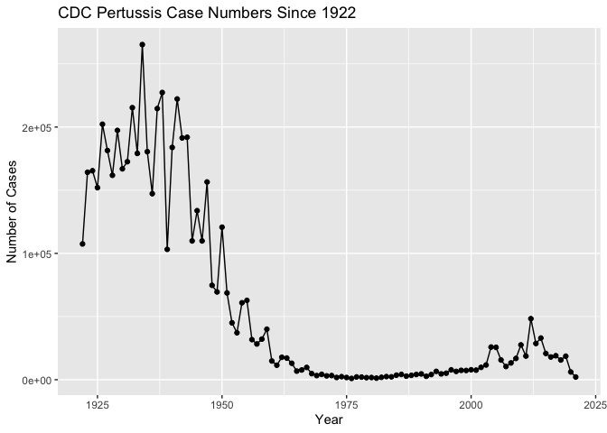
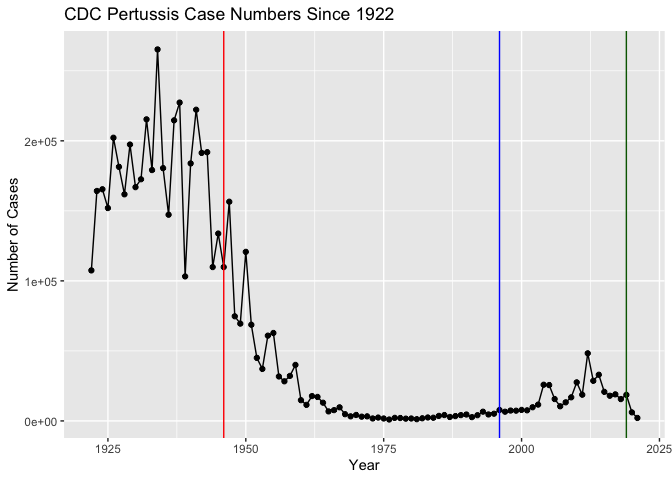
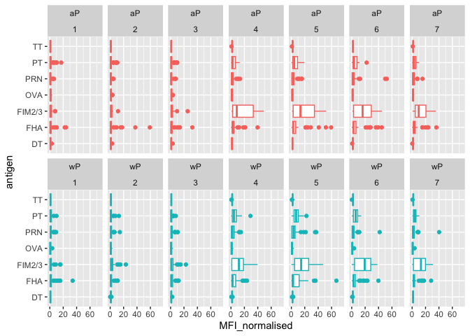
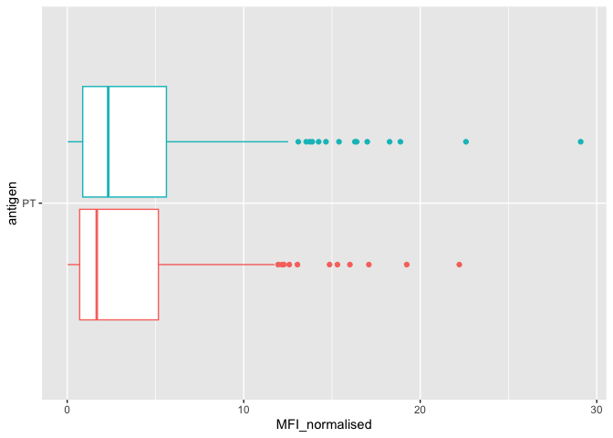
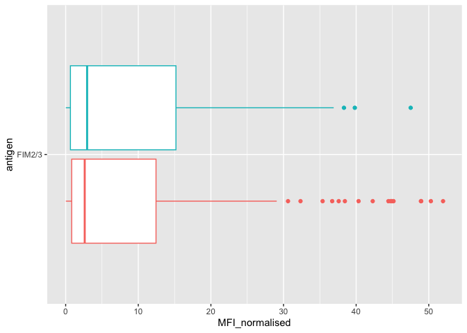
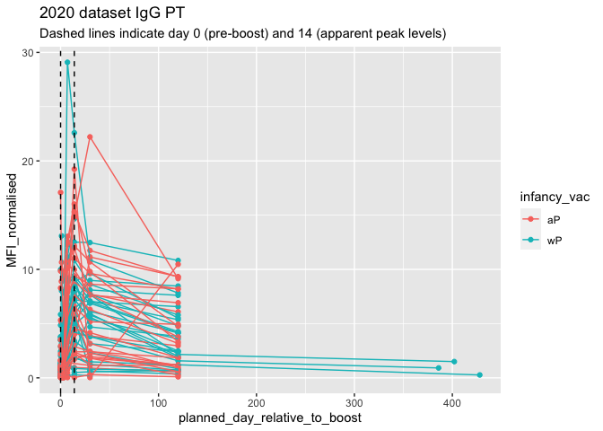

Class 19 Mini Project
================
Torrey Rhyne (A14397504)

## Investigating pertussis cases by year

The United States Centers for Disease Control and Prevention (CDC) has
been compiling reported pertussis case numbers since 1922 in their
National Notifiable Diseases Surveillance System (NNDSS).

We can view this data on the CDC website here:
https://www.cdc.gov/pertussis/surv-reporting/cases-by-year.html

Setup:

``` r
# install.packages("datapasta")
library(datapasta)
library(ggplot2)
library(jsonlite)
library(lubridate)
```


    Attaching package: 'lubridate'

    The following objects are masked from 'package:base':

        date, intersect, setdiff, union

``` r
library(dplyr)
```


    Attaching package: 'dplyr'

    The following objects are masked from 'package:stats':

        filter, lag

    The following objects are masked from 'package:base':

        intersect, setdiff, setequal, union

Q1. With the help of the **R “addin” package datapasta** assign the CDC
pertussis case number data to a data frame called cdc and use ggplot to
make a plot of cases numbers over time.

Paste CDC data:

``` r
cdc <- data.frame(
                            year = c(1922L,1923L,1924L,1925L,1926L,1927L,
                                     1928L,1929L,1930L,1931L,1932L,1933L,1934L,
                                     1935L,1936L,1937L,1938L,1939L,1940L,
                                     1941L,1942L,1943L,1944L,1945L,1946L,
                                     1947L,1948L,1949L,1950L,1951L,1952L,
                                     1953L,1954L,1955L,1956L,1957L,1958L,
                                     1959L,1960L,1961L,1962L,1963L,1964L,
                                     1965L,1966L,1967L,1968L,1969L,1970L,
                                     1971L,1972L,1973L,1974L,1975L,1976L,1977L,
                                     1978L,1979L,1980L,1981L,1982L,1983L,
                                     1984L,1985L,1986L,1987L,1988L,1989L,
                                     1990L,1991L,1992L,1993L,1994L,1995L,
                                     1996L,1997L,1998L,1999L,2000L,2001L,
                                     2002L,2003L,2004L,2005L,2006L,2007L,
                                     2008L,2009L,2010L,2011L,2012L,2013L,
                                     2014L,2015L,2016L,2017L,2018L,2019L,2020L,
                                     2021L),
                            cases = c(107473,164191,165418,152003,202210,181411,
                                     161799,197371,166914,172559,215343,
                                     179135,265269,180518,147237,214652,
                                     227319,103188,183866,222202,191383,191890,
                                     109873,133792,109860,156517,74715,
                                     69479,120718,68687,45030,37129,60886,
                                     62786,31732,28295,32148,40005,14809,
                                     11468,17749,17135,13005,6799,7717,9718,
                                     4810,3285,4249,3036,3287,1759,2402,
                                     1738,1010,2177,2063,1623,1730,1248,
                                     1895,2463,2276,3589,4195,2823,3450,4157,
                                     4570,2719,4083,6586,4617,5137,7796,
                                     6564,7405,7298,7867,7580,9771,11647,
                                     25827,25616,15632,10454,13278,16858,
                                     27550,18719,48277,28639,32971,20762,
                                     17972,18975,15609,18617,6124,2116)
  )
```

Plot:

``` r
p1 <- ggplot(cdc) +
  aes(x = year, y = cases) +
  geom_point() +
  geom_line() +
  labs(x = "Year", y = "Number of Cases", title = "CDC Pertussis Case Numbers Since 1922")
p1
```



## A tale of two vaccines (wP & aP)

Let’s return to our CDC data plot and examine what happened after the
switch to the acellular pertussis (aP) vaccination program.

Q2. Using the ggplot geom_vline() function add lines to your previous
plot for the 1946 introduction of the wP vaccine and the 1996 switch to
aP vaccine (see example in the hint below). What do you notice? Also add
the 2019 COVID pandemic.

``` r
p2 <- p1 + 
  geom_vline(xintercept = 1946, color = "red") +
  geom_vline(xintercept = 1996, color = "blue") +
  geom_vline(xintercept = 2019, color = "darkgreen")
p2
```



Q3. Describe what happened after the introduction of the aP vaccine? Do
you have a possible explanation for the observed trend?

The pertussis field has several hypotheses for the resurgence of
pertussis including: 1) more sensitive PCR-based testing 2) vaccination
hesitancy 3) bacterial evolution (escape from vaccine immunity) 4)
waning of immunity in adolescents originally primed as infants with the
newer aP vaccine as compared to the older wP vaccine

## Exploring CMI-PB data

The CMI-PB project collects and makes available data on the immune
response to Pertussis booster vaccination.

Why is this vaccine-preventable disease on the upswing? To answer this
question we need to investigate the mechanisms underlying waning
protection against pertussis. This requires evaluation of
pertussis-specific immune responses over time in wP and aP vaccinated
individuals.

The new and ongoing CMI-PB project aims to provide the scientific
community with this very information. In particular, CMI-PB tracks and
makes freely available long-term humoral and cellular immune response
data for a large number of individuals who received either DTwP or DTaP
combination vaccines in infancy followed by Tdap booster vaccinations.
This includes complete API access to longitudinal RNA-Seq, AB Titer,
Olink, and live cell assay results directly from their website:
https://www.cmi-pb.org/

**The CMI-PB API returns JSON data** (more robust than downloading a
bunch of files)

Access the data via the API. We will use the **jsonlite** package to
access the data using the `read_json()` function.

``` r
subject <- read_json("https://www.cmi-pb.org/api/subject", simplifyVector = TRUE)
head(subject, 3)
```

      subject_id infancy_vac biological_sex              ethnicity  race
    1          1          wP         Female Not Hispanic or Latino White
    2          2          wP         Female Not Hispanic or Latino White
    3          3          wP         Female                Unknown White
      year_of_birth date_of_boost      dataset
    1    1986-01-01    2016-09-12 2020_dataset
    2    1968-01-01    2019-01-28 2020_dataset
    3    1983-01-01    2016-10-10 2020_dataset

Q4. How many aP and wP infancy vaccinated subjects are in the dataset?

``` r
table(subject$infancy_vac)
```


    aP wP 
    60 58 

Q5. How many Male and Female subjects/patients are in the dataset?

``` r
table(subject$biological_sex)
```


    Female   Male 
        79     39 

Q6. What is the breakdown of race and biological sex (e.g. number of
Asian females, White males etc…)?

``` r
df <- data.frame(subject$race, subject$biological_sex)
table(df)
```

                                               subject.biological_sex
    subject.race                                Female Male
      American Indian/Alaska Native                  0    1
      Asian                                         21   11
      Black or African American                      2    0
      More Than One Race                             9    2
      Native Hawaiian or Other Pacific Islander      1    1
      Unknown or Not Reported                       11    4
      White                                         35   20

Q7. Using this approach determine (i) the average age of wP individuals,
(ii) the average age of aP individuals; and (iii) are they significantly
different?

``` r
subject$age <- today() - ymd(subject$year_of_birth)

# I
subject_wP <- subject %>% filter(infancy_vac == "wP")
subject_wP$age <- today() - ymd(subject_wP$year_of_birth)
mean(subject_wP$age)/365
```

    Time difference of 36.35465 days

``` r
print("years, not days")
```

    [1] "years, not days"

``` r
# II 
subject_aP <- subject %>% filter(infancy_vac == "aP")
subject_aP$age <- today() - ymd(subject_aP$year_of_birth)
mean(subject_aP$age)/365
```

    Time difference of 26.05087 days

``` r
print("years, not days")
```

    [1] "years, not days"

``` r
# III
tt <- t.test(time_length(subject_wP$age, "years"),
              time_length(subject_aP$age, "years"))
tt$p.value
```

    [1] 6.813505e-19

Q8. Determine the age of all individuals at time of boost?

``` r
int <- ymd(subject$date_of_boost) - ymd(subject$year_of_birth)
age_at_boost <- time_length(int, "year")
head(age_at_boost)
```

    [1] 30.69678 51.07461 33.77413 28.65982 25.65914 28.77481

Q9. With the help of a faceted boxplot or histogram (see below), do you
think these two groups are significantly different?

``` r
ggplot(subject) +
  aes(time_length(age, "year"),
      fill=as.factor(infancy_vac)) +
  geom_histogram(show.legend=FALSE) +
  facet_wrap(vars(infancy_vac), nrow=2) +
  xlab("Age in years")
```

    `stat_bin()` using `bins = 30`. Pick better value with `binwidth`.


Read the specimen and ab_titer tables into R and store the data as
specimen and titer named data frames.

``` r
# Complete the API URLs...
specimen <- read_json("https://www.cmi-pb.org/api//specimen", simplifyVector = TRUE) 
titer <- read_json("https://www.cmi-pb.org/api//plasma_ab_titer", simplifyVector = TRUE) 

head(specimen)
```

      specimen_id subject_id actual_day_relative_to_boost
    1           1          1                           -3
    2           2          1                            1
    3           3          1                            3
    4           4          1                            7
    5           5          1                           11
    6           6          1                           32
      planned_day_relative_to_boost specimen_type visit
    1                             0         Blood     1
    2                             1         Blood     2
    3                             3         Blood     3
    4                             7         Blood     4
    5                            14         Blood     5
    6                            30         Blood     6

``` r
head(titer)
```

      specimen_id isotype is_antigen_specific antigen        MFI MFI_normalised
    1           1     IgE               FALSE   Total 1110.21154       2.493425
    2           1     IgE               FALSE   Total 2708.91616       2.493425
    3           1     IgG                TRUE      PT   68.56614       3.736992
    4           1     IgG                TRUE     PRN  332.12718       2.602350
    5           1     IgG                TRUE     FHA 1887.12263      34.050956
    6           1     IgE                TRUE     ACT    0.10000       1.000000
       unit lower_limit_of_detection
    1 UG/ML                 2.096133
    2 IU/ML                29.170000
    3 IU/ML                 0.530000
    4 IU/ML                 6.205949
    5 IU/ML                 4.679535
    6 IU/ML                 2.816431

Q9. Complete the code to join specimen and subject tables to make a new
merged data frame containing all specimen records along with their
associated subject details:

``` r
meta <- inner_join(specimen, subject)
```

    Joining with `by = join_by(subject_id)`

``` r
dim(meta)
```

    [1] 939  14

``` r
head(meta)
```

      specimen_id subject_id actual_day_relative_to_boost
    1           1          1                           -3
    2           2          1                            1
    3           3          1                            3
    4           4          1                            7
    5           5          1                           11
    6           6          1                           32
      planned_day_relative_to_boost specimen_type visit infancy_vac biological_sex
    1                             0         Blood     1          wP         Female
    2                             1         Blood     2          wP         Female
    3                             3         Blood     3          wP         Female
    4                             7         Blood     4          wP         Female
    5                            14         Blood     5          wP         Female
    6                            30         Blood     6          wP         Female
                   ethnicity  race year_of_birth date_of_boost      dataset
    1 Not Hispanic or Latino White    1986-01-01    2016-09-12 2020_dataset
    2 Not Hispanic or Latino White    1986-01-01    2016-09-12 2020_dataset
    3 Not Hispanic or Latino White    1986-01-01    2016-09-12 2020_dataset
    4 Not Hispanic or Latino White    1986-01-01    2016-09-12 2020_dataset
    5 Not Hispanic or Latino White    1986-01-01    2016-09-12 2020_dataset
    6 Not Hispanic or Latino White    1986-01-01    2016-09-12 2020_dataset
             age
    1 13855 days
    2 13855 days
    3 13855 days
    4 13855 days
    5 13855 days
    6 13855 days

Q10. Now using the same procedure join meta with titer data so we can
further analyze this data in terms of time of visit aP/wP, male/female
etc.

``` r
abdata <- inner_join(titer, meta)
```

    Joining with `by = join_by(specimen_id)`

``` r
dim(abdata)
```

    [1] 41810    21

``` r
head(abdata)
```

      specimen_id isotype is_antigen_specific antigen        MFI MFI_normalised
    1           1     IgE               FALSE   Total 1110.21154       2.493425
    2           1     IgE               FALSE   Total 2708.91616       2.493425
    3           1     IgG                TRUE      PT   68.56614       3.736992
    4           1     IgG                TRUE     PRN  332.12718       2.602350
    5           1     IgG                TRUE     FHA 1887.12263      34.050956
    6           1     IgE                TRUE     ACT    0.10000       1.000000
       unit lower_limit_of_detection subject_id actual_day_relative_to_boost
    1 UG/ML                 2.096133          1                           -3
    2 IU/ML                29.170000          1                           -3
    3 IU/ML                 0.530000          1                           -3
    4 IU/ML                 6.205949          1                           -3
    5 IU/ML                 4.679535          1                           -3
    6 IU/ML                 2.816431          1                           -3
      planned_day_relative_to_boost specimen_type visit infancy_vac biological_sex
    1                             0         Blood     1          wP         Female
    2                             0         Blood     1          wP         Female
    3                             0         Blood     1          wP         Female
    4                             0         Blood     1          wP         Female
    5                             0         Blood     1          wP         Female
    6                             0         Blood     1          wP         Female
                   ethnicity  race year_of_birth date_of_boost      dataset
    1 Not Hispanic or Latino White    1986-01-01    2016-09-12 2020_dataset
    2 Not Hispanic or Latino White    1986-01-01    2016-09-12 2020_dataset
    3 Not Hispanic or Latino White    1986-01-01    2016-09-12 2020_dataset
    4 Not Hispanic or Latino White    1986-01-01    2016-09-12 2020_dataset
    5 Not Hispanic or Latino White    1986-01-01    2016-09-12 2020_dataset
    6 Not Hispanic or Latino White    1986-01-01    2016-09-12 2020_dataset
             age
    1 13855 days
    2 13855 days
    3 13855 days
    4 13855 days
    5 13855 days
    6 13855 days

Q11. How many specimens (i.e. entries in abdata) do we have for each
isotype?

``` r
table(abdata$isotype)
```


     IgE  IgG IgG1 IgG2 IgG3 IgG4 
    6698 3240 7968 7968 7968 7968 

Q12. What are the different \$dataset values in abdata and what do you
notice about the number of rows for the most “recent” dataset?

``` r
table(abdata$dataset)
```


    2020_dataset 2021_dataset 2022_dataset 
           31520         8085         2205 

Number of rows (entries) has gone down.

## Examine IgG Ab titer levels

Now using our joined/merged/linked abdata dataset filter() for IgG
isotype.

``` r
igg <- abdata %>% filter(isotype == "IgG")
head(igg)
```

      specimen_id isotype is_antigen_specific antigen        MFI MFI_normalised
    1           1     IgG                TRUE      PT   68.56614       3.736992
    2           1     IgG                TRUE     PRN  332.12718       2.602350
    3           1     IgG                TRUE     FHA 1887.12263      34.050956
    4          19     IgG                TRUE      PT   20.11607       1.096366
    5          19     IgG                TRUE     PRN  976.67419       7.652635
    6          19     IgG                TRUE     FHA   60.76626       1.096457
       unit lower_limit_of_detection subject_id actual_day_relative_to_boost
    1 IU/ML                 0.530000          1                           -3
    2 IU/ML                 6.205949          1                           -3
    3 IU/ML                 4.679535          1                           -3
    4 IU/ML                 0.530000          3                           -3
    5 IU/ML                 6.205949          3                           -3
    6 IU/ML                 4.679535          3                           -3
      planned_day_relative_to_boost specimen_type visit infancy_vac biological_sex
    1                             0         Blood     1          wP         Female
    2                             0         Blood     1          wP         Female
    3                             0         Blood     1          wP         Female
    4                             0         Blood     1          wP         Female
    5                             0         Blood     1          wP         Female
    6                             0         Blood     1          wP         Female
                   ethnicity  race year_of_birth date_of_boost      dataset
    1 Not Hispanic or Latino White    1986-01-01    2016-09-12 2020_dataset
    2 Not Hispanic or Latino White    1986-01-01    2016-09-12 2020_dataset
    3 Not Hispanic or Latino White    1986-01-01    2016-09-12 2020_dataset
    4                Unknown White    1983-01-01    2016-10-10 2020_dataset
    5                Unknown White    1983-01-01    2016-10-10 2020_dataset
    6                Unknown White    1983-01-01    2016-10-10 2020_dataset
             age
    1 13855 days
    2 13855 days
    3 13855 days
    4 14951 days
    5 14951 days
    6 14951 days

Q13. Complete the following code to make a summary boxplot of Ab titer
levels (MFI) for all antigens:

``` r
ggplot(igg) +
  aes(MFI_normalised, antigen) +
  geom_boxplot() +
   xlim(0,75) +
  facet_wrap(vars(visit), nrow=2)
```

    Warning: Removed 5 rows containing non-finite values (`stat_boxplot()`).


FIM2/3 vs. Fim2/3?

``` r
oops <- abdata %>% filter(antigen=="Fim2/3")
table(oops$dataset)
```

    < table of extent 0 >

Q14. What antigens show differences in the level of IgG antibody titers
recognizing them over time? Why these and not others? FIM2/3, FHA, PT -
These are pertussis proteins.

We can attempt to examine differences between wP and aP here by setting
color and/or facet values of the plot to include infancy_vac status (see
below). However these plots tend to be rather busy and thus hard to
interpret easily.

``` r
ggplot(igg) +
  aes(MFI_normalised, antigen, col=infancy_vac ) +
  geom_boxplot(show.legend = FALSE) + 
  facet_wrap(vars(visit), nrow=2) +
  xlim(0,75) +
  theme_bw()
```

    Warning: Removed 5 rows containing non-finite values (`stat_boxplot()`).


Another version of this plot adding infancy_vac to the faceting:

``` r
igg %>% filter(visit != 8) %>%
ggplot() +
  aes(MFI_normalised, antigen, col=infancy_vac ) +
  geom_boxplot(show.legend = FALSE) + 
  xlim(0,75) +
  facet_wrap(vars(infancy_vac, visit), nrow=2)
```

    Warning: Removed 5 rows containing non-finite values (`stat_boxplot()`).



Q15. Filter to pull out only two specific antigens for analysis and
create a boxplot for each. You can chose any you like. Below I picked a
“control” antigen (“OVA”, that is not in our vaccines) and a clear
antigen of interest (“PT”, Pertussis Toxin, one of the key virulence
factors produced by the bacterium B. pertussis).

``` r
PT <- igg %>% filter(antigen == "PT")

ggplot(PT) +
  aes(MFI_normalised, antigen, col=infancy_vac ) +
  geom_boxplot(show.legend = FALSE)
```



``` r
FIM <- igg %>% filter(antigen == "FIM2/3")

ggplot(FIM) +
  aes(MFI_normalised, antigen, col=infancy_vac ) +
  geom_boxplot(show.legend = FALSE)
```



Lets finish this section by looking at the 2021 dataset IgG PT antigen
levels time-course:

``` r
abdata.21 <- abdata %>% filter(dataset == "2021_dataset")

abdata.21 %>% 
  filter(isotype == "IgG",  antigen == "PT") %>%
  ggplot() +
    aes(x=planned_day_relative_to_boost,
        y=MFI_normalised,
        col=infancy_vac,
        group=subject_id) +
    geom_point() +
    geom_line() +
    geom_vline(xintercept=0, linetype="dashed") +
    geom_vline(xintercept=14, linetype="dashed") +
  labs(title="2021 dataset IgG PT",
       subtitle = "Dashed lines indicate day 0 (pre-boost) and 14 (apparent peak levels)")
```


Q18. Does this trend look similar for the 2020 dataset?

``` r
abdata.20 <- abdata %>% filter(dataset == "2020_dataset")

abdata.20 %>% 
  filter(isotype == "IgG",  antigen == "PT") %>%
  ggplot() +
    aes(x=planned_day_relative_to_boost,
        y=MFI_normalised,
        col=infancy_vac,
        group=subject_id) +
    geom_point() +
    geom_line() +
    geom_vline(xintercept=0, linetype="dashed") +
    geom_vline(xintercept=14, linetype="dashed") +
  labs(title="2020 dataset IgG PT",
       subtitle = "Dashed lines indicate day 0 (pre-boost) and 14 (apparent peak levels)")
```


