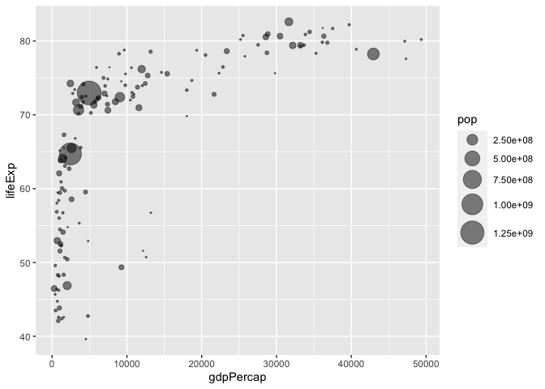

Lab 5: data visualization with ggplot2
================
Torrey (A14397504)

## (6) Getting Started / Creating Scatter Plots

To use packages, you need to (1) install with `install.packages()` and
(2) load with `library()`. Only install a package once in the “R brain”
(console).

``` r
# load packages
library(ggplot2)
library(gapminder)
library(dplyr)
```


    Attaching package: 'dplyr'

    The following objects are masked from 'package:stats':

        filter, lag

    The following objects are masked from 'package:base':

        intersect, setdiff, setequal, union

``` r
library(gganimate)
library(gifski)
library(patchwork)
```

View cars dataset:

``` r
head(cars) # don't want super long document 
```

      speed dist
    1     4    2
    2     4   10
    3     7    4
    4     7   22
    5     8   16
    6     9   10

Plot speed vs. distance:

``` r
ggplot(cars) + aes(x = speed, y = dist) + geom_point() 
```


``` r
# add trend line
ggplot(cars) + aes(x = speed, y = dist) + geom_point() + geom_smooth()
```

    `geom_smooth()` using method = 'loess' and formula = 'y ~ x'


``` r
# make the trend line linear and without the shading
ggplot(cars) + aes(x = speed, y = dist) + geom_point() + geom_smooth(method = "lm", se = F)
```

    `geom_smooth()` using formula = 'y ~ x'


``` r
# change theme and add labels
ggplot(cars) + aes(x = speed, y = dist) + geom_point() + geom_smooth(method = "lm", se = F) +
  theme_bw() +
  labs(x = "speed (MPH)", y = "stopping distance (feet)", title = "Cars - Speed vs. Stopping Distance")
```

    `geom_smooth()` using formula = 'y ~ x'


Add more aesthetics

New data:

``` r
# load data
url <- "https://bioboot.github.io/bimm143_S20/class-material/up_down_expression.txt"
genes <- read.delim(url)
head(genes)
```

            Gene Condition1 Condition2      State
    1      A4GNT -3.6808610 -3.4401355 unchanging
    2       AAAS  4.5479580  4.3864126 unchanging
    3      AASDH  3.7190695  3.4787276 unchanging
    4       AATF  5.0784720  5.0151916 unchanging
    5       AATK  0.4711421  0.5598642 unchanging
    6 AB015752.4 -3.6808610 -3.5921390 unchanging

``` r
# investigate
colnames(genes)
```

    [1] "Gene"       "Condition1" "Condition2" "State"     

``` r
nrow(genes)
```

    [1] 5196

``` r
table(genes$State)
```


          down unchanging         up 
            72       4997        127 

``` r
nrow(genes[genes$State == "up", ]) / nrow(genes)
```

    [1] 0.02444188

``` r
round(table(genes$State) / nrow(genes),2) # this is how Barry did it
```


          down unchanging         up 
          0.01       0.96       0.02 

Plot:

``` r
# condition 1 vs. 2
ggplot(genes) + aes(x=Condition1, y=Condition2) + geom_point()
```


``` r
# add color for state (expression)
p<- ggplot(genes) + aes(x=Condition1, y=Condition2, col = State) + geom_point()
p
```


``` r
# change the colors
p2 <- p + scale_color_manual(values = c("blue", "gray", "red"))
p2
```


``` r
# add labels
p3 <- p2 + labs(x = "control (no drug)", y = "drug treatment", title = "Gene Expression Changes Upon Drug Treatment")
p3
```


## (7) Going Further

Load data:

``` r
url <- "https://raw.githubusercontent.com/jennybc/gapminder/master/inst/extdata/gapminder.tsv"
gapminder <- read.delim(url)
```

Use dplyr for data manipulation:

``` r
gapminder_2007 <- gapminder %>% filter(year==2007)
head(gapminder)
```

          country continent year lifeExp      pop gdpPercap
    1 Afghanistan      Asia 1952  28.801  8425333  779.4453
    2 Afghanistan      Asia 1957  30.332  9240934  820.8530
    3 Afghanistan      Asia 1962  31.997 10267083  853.1007
    4 Afghanistan      Asia 1967  34.020 11537966  836.1971
    5 Afghanistan      Asia 1972  36.088 13079460  739.9811
    6 Afghanistan      Asia 1977  38.438 14880372  786.1134

Plot GDPperCap vs. life expectancy:

``` r
p4 <- ggplot(gapminder_2007) + aes(x = gdpPercap, y = lifeExp) + geom_point(); p4
```


``` r
# make partially transparent
p5 <- ggplot(gapminder_2007) + aes(x = gdpPercap, y = lifeExp) + geom_point(alpha = 0.5); p5
```


Add additional variables to the plot:

``` r
p6 <- ggplot(gapminder_2007) + 
  aes(x = gdpPercap, y = lifeExp, col = continent, size = pop) + 
  geom_point(alpha = 0.5)
p6
```


``` r
p7 <- ggplot(gapminder_2007) + 
  aes(x = gdpPercap, y = lifeExp, col = pop, size = continent) + 
  geom_point(alpha = 0.5)
p7
```

    Warning: Using size for a discrete variable is not advised.


``` r
# notice the differences in using color / size aesthetics for discrete (continent) vs. continuous (population) variables
```

Adjust point size:

``` r
p8 <- ggplot(gapminder_2007) + 
  aes(x = gdpPercap, y = lifeExp, size = pop) +
  geom_point(alpha=0.5)
p8
```


``` r
#scale
p9 <- ggplot(gapminder_2007) + 
  aes(x = gdpPercap, y = lifeExp, size = pop) +
  geom_point(alpha=0.5) +
  scale_size_area(max_size = 10)
p9
```



Recreate for 1957 data:

``` r
gapminder_1957 <- gapminder %>% filter(year == 1957 | year == 2007)
p10 <- ggplot(gapminder_1957) + aes(x = gdpPercap, y = lifeExp, col = continent, size = pop) + geom_point(alpha = 0.5) + scale_size_area(max_size = 10) +
  facet_wrap(~year)
p10
```


## (9) Extensions: Animation

Make the plot show change over time:

``` r
p11<- ggplot(gapminder, aes(gdpPercap, lifeExp, size = pop, colour = country)) +
  geom_point(alpha = 0.7, show.legend = FALSE) +
  scale_colour_manual(values = country_colors) +
  scale_size(range = c(2, 12)) +
  scale_x_log10() +
  # facet by continent
  facet_wrap(~continent) +
  # animation
  labs(title = 'Year: {frame_time}', x = 'GDP per capita', y = 'life expectancy') +
  transition_time(year) +
  shadow_wake(wake_length = 0.1, alpha = FALSE)
p11
```


## (10) Combining plots

``` r
# make indiviual plots
p12 <- ggplot(mtcars) + geom_point(aes(mpg, disp))
p13 <- ggplot(mtcars) + geom_boxplot(aes(gear, disp, group = gear))
p14 <- ggplot(mtcars) + geom_smooth(aes(disp, qsec))
p15 <- ggplot(mtcars) + geom_bar(aes(carb))

# combine with patchwork
(p12 | p13 | p14) /
      p15
```

    `geom_smooth()` using method = 'loess' and formula = 'y ~ x'


