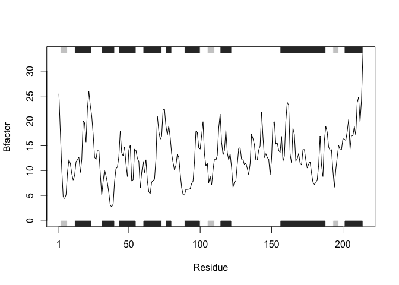

Homework 6: Write a Function
================
Torrey Rhyne (A14397504)

Load packages:

``` r
library(bio3d)
```

## Generalize the example code by writing a function

Example code:

``` r
s1 <- read.pdb("4AKE") 
```

      Note: Accessing on-line PDB file

``` r
s2 <- read.pdb("1AKE") 
```

      Note: Accessing on-line PDB file
       PDB has ALT records, taking A only, rm.alt=TRUE

``` r
s3 <- read.pdb("1E4Y") 
```

      Note: Accessing on-line PDB file

``` r
s1.chainA <- trim.pdb(s1, chain="A", elety="CA")
s2.chainA <- trim.pdb(s2, chain="A", elety="CA")
s3.chainA <- trim.pdb(s3, chain="A", elety="CA") # corrected error
s1.b <- s1.chainA$atom$b
s2.b <- s2.chainA$atom$b
s3.b <- s3.chainA$atom$b
plotb3(s1.b, sse=s1.chainA, typ="l", ylab="Bfactor")
```


``` r
plotb3(s2.b, sse=s2.chainA, typ="l", ylab="Bfactor")
```


``` r
plotb3(s3.b, sse=s3.chainA, typ="l", ylab="Bfactor")
```


My function:

``` r
protein <- function(x){ # input = PDB accession code
  s <- read.pdb(x) # read PDB coordinate file
  s.chainA <- trim.pdb(s, chain = "A", elety="CA") # trim to a subset of atoms
  s.b <- s.chainA$atom$b # select one vector ("b) from the list
  plotb3(s.b, sse=s.chainA, typ="l", ylab="Bfactor") # generate a scatter plot
}
```

Test my function:

``` r
# compare to output from example code 
protein("4AKE") 
```

      Note: Accessing on-line PDB file

    Warning in get.pdb(file, path = tempdir(), verbose = FALSE):
    /var/folders/kw/y425qndd13sg9ys06ggcw67h0000gn/T//RtmpbuLzBS/4AKE.pdb exists.
    Skipping download


``` r
protein("1AKE")
```

      Note: Accessing on-line PDB file

    Warning in get.pdb(file, path = tempdir(), verbose = FALSE):
    /var/folders/kw/y425qndd13sg9ys06ggcw67h0000gn/T//RtmpbuLzBS/1AKE.pdb exists.
    Skipping download

       PDB has ALT records, taking A only, rm.alt=TRUE


``` r
protein("1E4Y")
```

      Note: Accessing on-line PDB file

    Warning in get.pdb(file, path = tempdir(), verbose = FALSE):
    /var/folders/kw/y425qndd13sg9ys06ggcw67h0000gn/T//RtmpbuLzBS/1E4Y.pdb exists.
    Skipping download



``` r
# test a new accession code 
protein("6DRD")
```

      Note: Accessing on-line PDB file


## My function: protein()

Description: Analyzes protein drug interactions by reading in any
protein PDB data and outputs a plot for the specified protein.

Usage: protein(“x”), x = PDB accession code.
