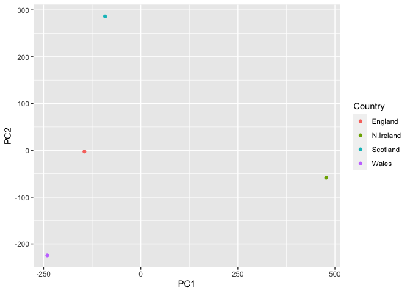

Class 7: machine learning for bioinformatics (part 1)
================
Torrey Rhyne (A14397504)

## k-means clustering

We will start with k-means clustering, one of the most prevalent of all
clustering methods. A disadvantage is that you need to know how many
clusters there should be (k = ?).

Generate random data:

``` r
tmp <- c(rnorm(30, 3), rnorm(30, -3))
data <- cbind(x=tmp, y = rev(tmp))
head(data)
```

                x           y
    [1,] 3.707239 -1.90252625
    [2,] 3.365653 -2.52541110
    [3,] 3.439612 -3.46527273
    [4,] 2.721048  0.03296809
    [5,] 2.698979 -1.94923524
    [6,] 2.628754 -2.81588999

``` r
plot(data)
```


The main function in R for k-means clustering is called `kmeans()`:

``` r
k <- kmeans(data, centers = 2, nstart = 20)
k # output is a list of "components"
```

    K-means clustering with 2 clusters of sizes 30, 30

    Cluster means:
              x         y
    1 -2.929125  2.776712
    2  2.776712 -2.929125

    Clustering vector:
     [1] 2 2 2 2 2 2 2 2 2 2 2 2 2 2 2 2 2 2 2 2 2 2 2 2 2 2 2 2 2 2 1 1 1 1 1 1 1 1
    [39] 1 1 1 1 1 1 1 1 1 1 1 1 1 1 1 1 1 1 1 1 1 1

    Within cluster sum of squares by cluster:
    [1] 63.45834 63.45834
     (between_SS / total_SS =  88.5 %)

    Available components:

    [1] "cluster"      "centers"      "totss"        "withinss"     "tot.withinss"
    [6] "betweenss"    "size"         "iter"         "ifault"      

How many points are in each cluster?

``` r
k[7]
```

    $size
    [1] 30 30

``` r
k$size
```

    [1] 30 30

Make a plot of our data colored by clustering results with the cluster
centers shown:

``` r
plot(data, col = k$cluster, pch = 16)
points(k$centers, col = "blue", pch = 15, cex = 2)
```


What if we did 3 clusters?

``` r
k <- kmeans(data, centers = 3, nstart = 20)
plot(data, col = k$cluster, pch = 16)
points(k$centers, col = "blue", pch = 15, cex = 2)
```


## Hierarchial Clustering

Hierarchical clustering has the advantage that it can reveal the
structure in your data rather than imposing a structure (k-means).

The main function in base R is `hclust()`. It requires a distance matrix
as its input, not the data itself:

``` r
hc <- hclust(dist(data))
hc # output isn't very helpful
```


    Call:
    hclust(d = dist(data))

    Cluster method   : complete 
    Distance         : euclidean 
    Number of objects: 60 

Plot:

``` r
plot(hc)
# cut the tree
abline(h=8, col="red")
```


The function to get our clusters/groups from a hclust object is called
`cutree()`:

``` r
groups <- cutree(hc,h=8)
```

Plot hclust results in terms of our data colored by cluster membership:

``` r
plot(data, col = groups)
```


Produced the same output, but we didn’t need to know groups = 2
beforehand.

## Principal Component Analysis (PCA)

## (1) PCA of UK food data

Import data:

``` r
# load
url <- "https://tinyurl.com/UK-foods"
data <- read.csv(url, row.names = 1) # this is better than rownames(x) <- x[,1] approach

# examine data
str(data)
```

    'data.frame':   17 obs. of  4 variables:
     $ England  : int  105 245 685 147 193 156 720 253 488 198 ...
     $ Wales    : int  103 227 803 160 235 175 874 265 570 203 ...
     $ Scotland : int  103 242 750 122 184 147 566 171 418 220 ...
     $ N.Ireland: int  66 267 586 93 209 139 1033 143 355 187 ...

``` r
head(data)
```

                   England Wales Scotland N.Ireland
    Cheese             105   103      103        66
    Carcass_meat       245   227      242       267
    Other_meat         685   803      750       586
    Fish               147   160      122        93
    Fats_and_oils      193   235      184       209
    Sugars             156   175      147       139

``` r
nrow(data)
```

    [1] 17

``` r
ncol(data)
```

    [1] 4

Try to visualize 17 variables with a bar plot:

``` r
barplot(as.matrix(data), beside=T, col=rainbow(nrow(data)))
```


``` r
barplot(as.matrix(data), beside=F, col=rainbow(nrow(data)))
```


Try generating all pairwise plots:

``` r
pairs(data, col=rainbow(10), pch=16)
```


``` r
# point on the diagonal means those 2 countries have a similar value for that variable 
# the colored points represent the 17 variables (ex: "cheese")
```

These plots are difficult to make sense of. PCA to the rescue!

The main function for PCA in base R is called `prcomp()`:

``` r
pca <- prcomp(t(data)) # need to transpose because PCA expects variables to be columns
summary(pca)
```

    Importance of components:
                                PC1      PC2      PC3       PC4
    Standard deviation     324.1502 212.7478 73.87622 2.921e-14
    Proportion of Variance   0.6744   0.2905  0.03503 0.000e+00
    Cumulative Proportion    0.6744   0.9650  1.00000 1.000e+00

PCA output (like k-means) is a list. One of the main PCA results people
use is a 2D “score plot” (PC1 vs. PC2):

``` r
pca$x
```

                     PC1         PC2        PC3           PC4
    England   -144.99315   -2.532999 105.768945 -9.152022e-15
    Wales     -240.52915 -224.646925 -56.475555  5.560040e-13
    Scotland   -91.86934  286.081786 -44.415495 -6.638419e-13
    N.Ireland  477.39164  -58.901862  -4.877895  1.329771e-13

``` r
# plot just PC1 vs. PC2 (represent 96.5% of the variance)
plot(pca$x[,1], pca$x[,2], xlab="PC1", ylab="PC2", xlim=c(-270,500), ylim=c(-300,300))
text(pca$x[,1], pca$x[,2], colnames(data))
```


Add color:

``` r
color <- c("orange", "red", "blue", "green")
plot(pca$x[,1], pca$x[,2], xlab="PC1", ylab="PC2", xlim=c(-270,500), ylim=c(-300,300))
text(pca$x[,1], pca$x[,2], colnames(data), col = color)
```


Variable loadings:

Calculate how much variation in the original data each PC accounts for:

``` r
s <- summary(pca)
s$importance
```

                                 PC1       PC2      PC3          PC4
    Standard deviation     324.15019 212.74780 73.87622 2.921348e-14
    Proportion of Variance   0.67444   0.29052  0.03503 0.000000e+00
    Cumulative Proportion    0.67444   0.96497  1.00000 1.000000e+00

This information can be summarized in a plot of the variances
(eigenvalues) with respect to the principal component number
(eigenvector number). Plot:

``` r
barplot(s$importance[2,], xlab="Principal Component", ylab="Percent Variation")
```


We can also consider the influence of each of the original variables
upon the principal components (typically known as loading scores). This
information can be obtained from the prcomp() returned \$rotation
component.

Plot (focus on PC1 since it accounts for \>90% of the variance):

``` r
par(mar=c(10, 3, 0.35, 0))
barplot( pca$rotation[,1], las=2 )
```


Here we see variables (foods) with the largest positive / negative
“loading scores” that effectively “push” observations (countries) to
right / left side of the plot.

Generate a similar ‘loadings plot’ for PC2. What two food groups feature
prominently and what does PC2 mainly tell us about?

``` r
par(mar=c(10, 3, 0.35, 0))
barplot( pca$rotation[,2], las=2 )
```


The largest positive loading score = soft drinks, pushing Scotland to
the top of the plot. The largest negative loading score = fresh
potatoes, pushing Wales to the bottom of the plot.

Let’s make the score plot figure look nicer with ggplot:

``` r
library(ggplot2)

df <- as.data.frame(pca$x)
df_lab <- tibble::rownames_to_column(df, "Country")
# first basic plot
ggplot(df_lab) + 
  aes(PC1, PC2, col=Country) + 
  geom_point()
```



``` r
# nicer plot
ggplot(df_lab) + 
  aes(PC1, PC2, col=Country, label=Country) + 
  geom_hline(yintercept = 0, col="gray") +
  geom_vline(xintercept = 0, col="gray") +
  geom_point(show.legend = FALSE) +
  geom_label(hjust=1, nudge_x = -10, show.legend = FALSE) +
  expand_limits(x = c(-300,500)) +
  xlab("PC1 (67.4%)") +
  ylab("PC2 (28%)") +
  theme_bw()
```


Let’s do the same for our loadings/PC contributions figures:

``` r
ld <- as.data.frame(pca$rotation)
ld_lab <- tibble::rownames_to_column(ld, "Food")

# first basic plot
ggplot(ld_lab) +
  aes(PC1, Food) +
  geom_col() 
```


``` r
# nicer plot
ggplot(ld_lab) +
  aes(PC1, reorder(Food, PC1), bg=PC1) +
  geom_col() + 
  xlab("PC1 Loadings/Contributions") +
  ylab("Food Group") +
  scale_fill_gradient2(low="purple", mid="gray", high="darkgreen", guide=NULL) +
  theme_bw()
```


Another way to see this information together with the main PCA plot is
in a so-called biplot:

``` r
## can be useful for small datasets 
biplot(pca)
```


Summary: PCA has the awesome ability to be able to make these
associations for us. It has also successfully managed to reduce the
dimensionality of our data set down from 17 to 2, allowing us to assert
(using our figures above) that countries England, Wales and Scotland are
‘similar’ with Northern Ireland being different in some way.
Furthermore, digging deeper into the loadings we were able to associate
certain food types with each cluster of countries.

## PCA of RNA-seq data
